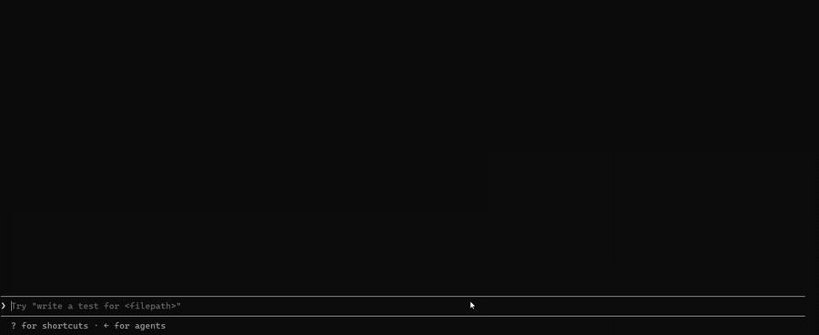

<div align="center">

# 📋 SnapPaste Pro

### Mac-style screenshot paste for Windows terminals

**Paste screenshots straight into your terminal with `Ctrl + V` — exactly like macOS.**
Works in CMD, PowerShell, Windows Terminal, and Claude Code.

[](https://www.npmjs.com/package/snappaste-pro)
[](https://www.npmjs.com/package/snappaste-pro)
[](https://github.com/saqibbinshabbir007/snappaste-pro/stargazers)
[](LICENSE)


[**Download**](https://github.com/saqibbinshabbir007/snappaste-pro/releases/latest) ·
[**npm**](https://www.npmjs.com/package/snappaste-pro) ·
[**Report a bug**](https://github.com/saqibbinshabbir007/snappaste-pro/issues)

</div>

---

## 🎬 Demo

<p align="center">
  
</p>

> A screenshot pasted straight into the terminal with **`Ctrl + V`** — and the AI reads it instantly. That's the whole point. 🎯

---

## ⚡ Quick Start

**For everyone — installer (no Node.js, no admin):**
1. [**Download `SnapPaste-Pro-Setup.exe`**](https://github.com/saqibbinshabbir007/snappaste-pro/releases/latest)
2. Run it → **Next → Next → Finish**
3. Take a screenshot and press `Ctrl + V` in your terminal 🎉

**For developers — npm:**
```bash
npx snappaste-pro install
```

---

## ❓ Why

On macOS you can paste a screenshot straight into a terminal. On Windows you can't —
the clipboard holds an **image**, but terminals only paste **text**. So `Ctrl + V`
does nothing, and you're stuck saving the file by hand and typing its path.

**SnapPaste Pro fixes that.** When you press `Ctrl + V` in a terminal:

- 🖼️ **Image on the clipboard** → it's saved as a PNG and its **file path** is pasted automatically.
- 📝 **Text on the clipboard** → normal paste, nothing changes.

Perfect for **Claude Code**, AI coding assistants, and anything where you need to hand a screenshot to the terminal.

---

## ✨ Features

- 🖼️ **Image → path, instantly** — screenshots become a ready-to-use file path.
- 🪶 **Lightweight & clean** — no Python, no extra runtimes; AutoHotkey is bundled.
- 🔒 **No admin required** — installs per-user.
- 🚀 **Auto-start** — runs quietly in the background on login.
- 🎯 **Smart** — only triggers on images; text paste is untouched and just as fast.
- 🧰 **Extra commands** — `pi` (PowerShell) and `pasteimg` (CMD).
- 🌐 **Private & offline** — never sends any data anywhere.

---

## 📦 Install (details)

### Option 1 — Installer (recommended)
1. Download **`SnapPaste-Pro-Setup.exe`** from the [Releases](https://github.com/saqibbinshabbir007/snappaste-pro/releases/latest) page.
2. Run it (Next → Next → Finish). No admin needed.
3. Done — take a screenshot and press `Ctrl + V` in your terminal.

> ### ⚠️ "Windows protected your PC" — this is normal, please read
>
> The first time you run the installer, Windows SmartScreen may show a blue
> **"Windows protected your PC"** screen with **"Unknown publisher"**.
>
> **This does _not_ mean the app is unsafe.** It only appears because the app is
> not yet code-signed (a paid certificate we haven't purchased yet). To continue:
>
> 1. Click **More info**
> 2. Click **Run anyway**
>
> That's it — it won't ask again. ✅
>
> **Why you can trust it:** the entire source code is public in this repo, so anyone
> can read exactly what it does. It works fully offline — it never sends any data
> anywhere, doesn't touch your files, and only reacts to `Ctrl + V` inside terminals.

### Option 2 — npm (for developers)
```bash
npx snappaste-pro install
```
Requires [Node.js](https://nodejs.org). Other commands:

```bash
npx snappaste-pro status      # show status
npx snappaste-pro start       # start it now
npx snappaste-pro uninstall   # remove completely
```
See it on npm: **https://www.npmjs.com/package/snappaste-pro**

---

## 🚀 Usage

1. Take a screenshot: **`Win + Shift + S`** (select a region).
2. In your terminal, press **`Ctrl + V`**.
3. The image is saved to `Pictures\SnapPaste Pro\` and its path is pasted.

**Extra commands**

| Shell | Command |
|---|---|
| PowerShell | `pi` then `Ctrl + V` |
| Command Prompt | `pasteimg` then `Ctrl + V` |

**Supported terminals:** Windows Terminal, CMD, PowerShell, PowerShell 7 (pwsh), Claude Code, conhost.

---

## 🛠️ How it works

A small bundled [AutoHotkey](https://www.autohotkey.com/) script watches for `Ctrl + V`
in terminal windows. If the clipboard holds an image, it saves it as a PNG, replaces the
clipboard with the file path, and pastes that. If the clipboard holds text, it just pastes
normally. Everything runs locally on your machine.

---

## 🙋 FAQ

**Is it safe?**
Yes. It's open-source (read the code here), runs fully offline, sends no data anywhere,
doesn't touch your personal files, and only reacts to `Ctrl + V` inside terminal windows.

**Why does Windows show a SmartScreen warning?**
Because the installer isn't code-signed yet (signing is a paid certificate). It does **not**
mean the app is harmful — click **More info → Run anyway**.

**Where are my screenshots saved?**
In `…\Pictures\SnapPaste Pro\`, named `screenshot_<timestamp>.png`.

**Which terminals are supported?**
Windows Terminal, CMD, PowerShell, PowerShell 7 (pwsh), Claude Code, and conhost.

**Does it slow down normal copy/paste?**
No. It only acts when the clipboard contains an image; text paste is unchanged.

---

## 🗑️ Uninstall

**Settings → Apps → SnapPaste Pro → Uninstall** (or `npx snappaste-pro uninstall`).
It cleanly removes the app, the startup entry, the PATH entry, and the PowerShell profile addition.

---

## 🧱 Build from source

Requirements: [Inno Setup 6](https://jrsoftware.org/isdl.php) and the
[AutoHotkey v2](https://www.autohotkey.com/) runtime (`AutoHotkey64.exe`) placed in `src/`.

```powershell
ISCC.exe SnapPastePro.iss
# Output: Output\SnapPaste-Pro-Setup.exe
```

---

## 📄 License

[MIT](LICENSE) © Saqib Bin Shabbir

> Bundles the [AutoHotkey](https://www.autohotkey.com/) runtime, which is licensed under the GNU GPLv2.

---

<div align="center">

### Built by **Saqib Bin Shabbir**
Full Stack Developer &amp; Agentic AI Specialist

[GitHub](https://github.com/saqibbinshabbir007) ·
[npm](https://www.npmjs.com/package/snappaste-pro) ·
[Issues](https://github.com/saqibbinshabbir007/snappaste-pro/issues)

**If SnapPaste Pro saved you time, please give it a ⭐ — it really helps!**

</div>
